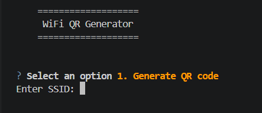
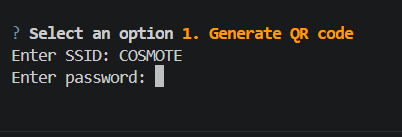
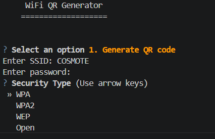
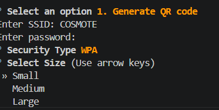
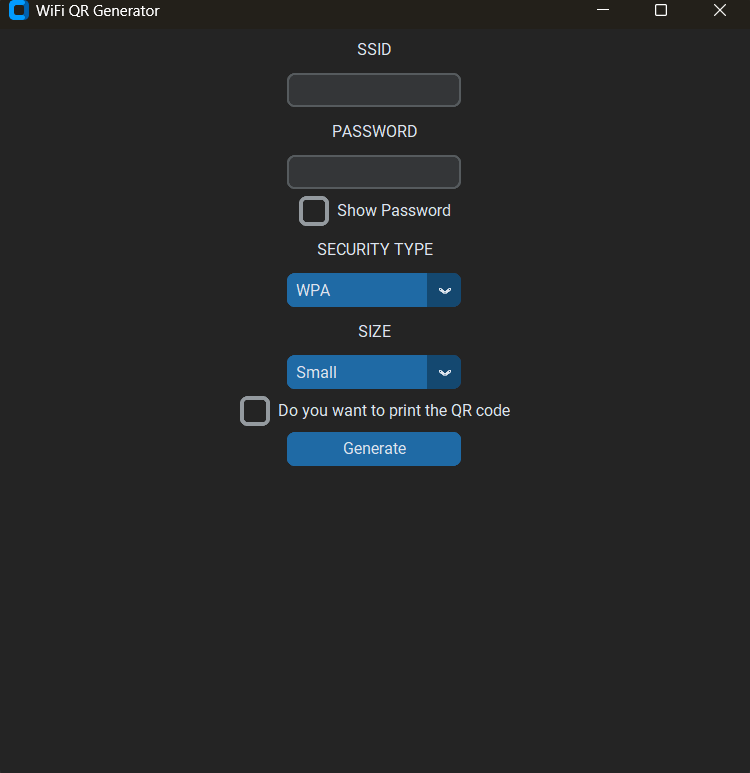

# WiFi QR Generator

A small tool for creating QR codes for WiFi networks. You can use it either from the terminal with the CLI version or through the desktop GUI.

## Features

* **CLI and GUI versions**

  * CLI for generating QR codes directly from the terminal.
  * GUI built with `CustomTkinter`.
* Choose where the generated QR code should be saved.
* Show or hide the WiFi password in the GUI.
* Input validation and error handling.
* Printing support is included, but is still in beta.

## Getting Started

1. Download the latest GitHub release. It includes the `.exe` files for both the CLI and GUI versions.
2. Run the version you want to use.
3. Enter your WiFi details and generate the QR code.

## How to Use

### CLI

When you start the CLI, you can choose between:

* **Generate QR code** — Create a new WiFi QR code.
* **View history** — View previously generated QR codes.
* **Delete history** — Clear the saved generation history.
* **Exit** — Close the program.

### Generating a QR Code

#### 1. Enter the SSID

Enter the name of your WiFi network.

#### 2. Enter the password

Enter the WiFi password.

The password is hidden while typing, so it won't appear on the terminal screen.

#### 3. Select the security type

Choose the security type used by your network.

#### 4. Select the QR code size

Choose the size of the QR code.

#### 5. QR code generated

After generation, the QR code is saved and opened automatically.

## GUI

The GUI follows the same basic process:

1. Enter the SSID.
2. Enter the WiFi password.
3. Select the security type.
4. Choose the QR code size.
5. Choose whether to print the QR code.
6. Press **Generate**.

> The print option is currently in beta and, for now, only works on Windows.
